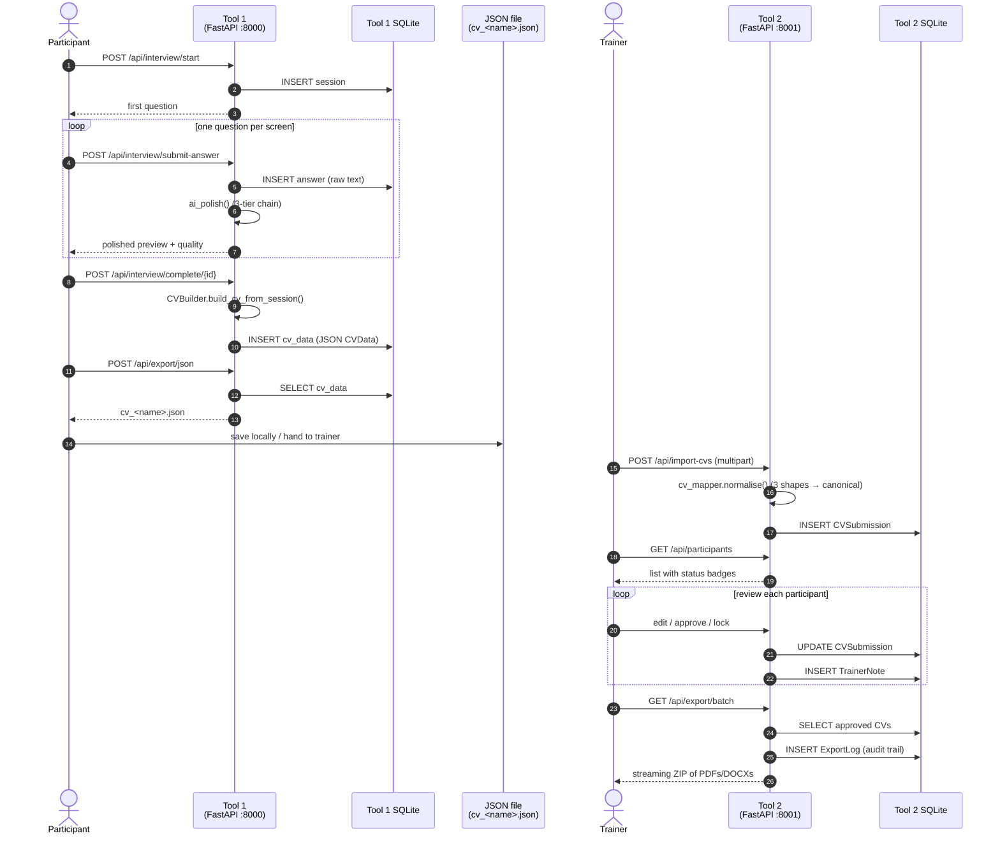
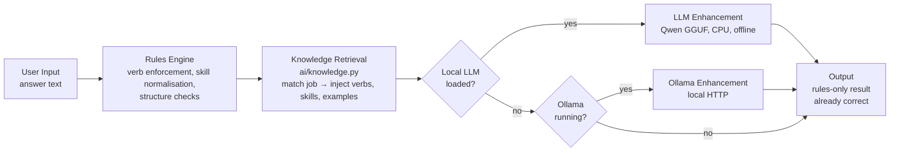

# AMS JobAssist — Architecture Reference

**Audience**: Developers, code reviewers
**Last Updated**: 2026-05-14
**Tool 1 status**: Production-ready — 507 tests passing
**Tool 2 status**: Production-ready — 42 tests passing
**Test suite total**: 549 passing


---

## Overview

Two tools share one repository:

- **Tool 1 — CV Maker** is the participant-facing application. A FastAPI backend serves a vanilla-JS single-page UI. It runs entirely offline. Each interview session lives in its own local SQLite database.
- **Tool 2 — Trainer Dashboard** is the trainer-facing application. A separate FastAPI backend with its own SQLite database. It imports JSON exports produced by Tool 1, supports inline review/approve/lock, and bulk-exports CVs in PDF/DOCX.

Both tools run on `127.0.0.1`, default offline, packaged as standalone Windows executables.

```
AMS-JobAssist/
├── tool-1-cv-maker/          Participant interview + CV builder (port 8000)
├── tool-2-trainer-dashboard/ Trainer supervision tool         (port 8001)
├── shared/                   Cross-tool schema + utility helpers
├── packaging/                PyInstaller specs + icon
├── docs/                     Trainer guides, screenshots, img/
├── launcher.py               Single-entry dev launcher (opens both tools)
└── build_all.bat             One-command build of all 3 executables
```

---

## Key files at a glance

| Concern | File | What it does |
|---------|------|-------------|
| **Tool 1 entrypoint** | `tool-1-cv-maker/src/backend/app.py` | FastAPI app factory + lifespan |
| Tool 1 config | `tool-1-cv-maker/src/backend/config.py` | Paths, defaults, `PRIVACY_MODE` |
| Tool 1 DB | `tool-1-cv-maker/src/backend/db.py` + `schema.sql` | SQLite wrapper + DDL |
| Interview state machine | `tool-1-cv-maker/src/backend/interview/engine.py` | Session state, autosave, resume |
| Interview paths | `tool-1-cv-maker/src/backend/interview/paths.py` | 5 hardcoded path definitions |
| Conversational follow-ups | `tool-1-cv-maker/src/backend/interview/conversational.py` | LLM-driven targeted probes |
| Autosave | `tool-1-cv-maker/src/backend/interview/autosave.py` | Transaction-based persistence |
| AI local LLM | `tool-1-cv-maker/src/backend/ai/local_llm.py` | Qwen GGUF (3 tiers) via llama-cpp-python — enhancement engine |
| AI Ollama fallback | `tool-1-cv-maker/src/backend/ai/ollama.py` | Used if local model absent and Ollama running |
| AI Knowledge Base | `tool-1-cv-maker/src/backend/ai/knowledge.py` | RAG retrieval over 25 Austrian jobs (berufe.json) |
| Knowledge data | `tool-1-cv-maker/data/knowledge/berufe.json` | 25 jobs, 197 verbs, 171 skills, 75 example phrases |
| Rule DB expansion | `tool-1-cv-maker/src/backend/db_seed_expansion.py` | Expanded verb/skill/ATS seed data (70 EN / 117 DE verbs, 428 skills, 63 ATS keywords) |
| Polish engine | `tool-1-cv-maker/src/backend/polish/engine.py` | Rules first → Knowledge retrieval → LLM enhancement (`ai_polish`) |
| Language normaliser | `tool-1-cv-maker/src/backend/polish/language.py` | 14-language detect + translate |
| ATS scoring | `tool-1-cv-maker/src/backend/polish/ats.py` | Keyword match vs job ad |
| CV model | `tool-1-cv-maker/src/backend/cv/models.py` | `CVData` / `CVSection` dataclasses |
| CV builder | `tool-1-cv-maker/src/backend/cv/builder.py` | Assembles `CVData` from answers |
| Cover letter | `tool-1-cv-maker/src/backend/cv/cover_letter.py` | Generates draft letter |
| PDF/DOCX/JSON/Europass | `tool-1-cv-maker/src/backend/export/*.py` | Four exporters share `base.py` |
| API routes (Tool 1) | `tool-1-cv-maker/src/backend/api/interview.py` | All Tool 1 REST endpoints |
| Privacy enforcement | `tool-1-cv-maker/src/backend/privacy/network_block.py` | Loopback allowlist on `socket` |
| **Tool 2 entrypoint** | `tool-2-trainer-dashboard/src/backend/app.py` | FastAPI app factory + lifespan |
| Tool 2 models | `tool-2-trainer-dashboard/src/backend/models.py` | `CVSubmission`, `Cohort`, `TrainerNote`, `ExportLog`, `CohortMetrics` |
| Tool 2 CV mapper | `tool-2-trainer-dashboard/src/backend/services/cv_mapper.py` | Normalises Tool 1 JSON shapes |
| Tool 2 API routes | `tool-2-trainer-dashboard/src/backend/api/routes.py` | All Tool 2 REST endpoints |
| **Packaging** | `packaging/launcher.spec` / `build_tool1.spec` / `build_tool2.spec` | Relocatable PyInstaller specs |
| Build script | `build_all.bat` | Produces 3 .exe artifacts in `dist/` |
| Dev launcher | `launcher.py` | Boots both tools, opens browser |

---

## Tool 1 — Module Map

```
tool-1-cv-maker/src/backend/
│
├── app.py                  FastAPI app factory + lifespan (DB init, exporters, AI warmup)
├── db.py                   DatabaseManager — ACID SQLite wrapper
├── schema.sql              DDL — single source of truth
├── config.py               Paths, env defaults, PRIVACY_MODE flag
│
├── api/
│   ├── interview.py        Interview, export, AI endpoints
│   └── language_packs.py   Language pack management endpoints
│
├── interview/
│   ├── engine.py           InterviewEngine — session state machine
│   ├── paths.py            Question definitions for all 5 paths
│   ├── conversational.py   LLM-driven follow-up question generator
│   ├── autosave.py         AutosaveManager — transaction-based persistence
│   └── translations.py     UI string translations (14 languages)
│
├── ai/
│   ├── local_llm.py        Qwen GGUF (3 tiers) via llama-cpp-python — LLM enhancement engine
│   ├── ollama.py           Ollama fallback (if local model absent)
│   └── knowledge.py        RAG knowledge base — 25 Austrian jobs from data/knowledge/berufe.json
│
├── polish/
│   ├── engine.py           PolishEngine — `ai_polish()` dispatches: rules → knowledge → LLM enhancement
│   ├── language.py         LanguageNormalizer — 14-language detect + translate
│   └── ats.py              ATS keyword scoring against pasted job ad
│
├── cv/
│   ├── models.py           CVData / CVSection dataclasses (multilingual fields)
│   ├── builder.py          CVBuilder — assembles CVData from session answers
│   ├── storage.py          CVStorage — persists/retrieves CVData as JSON
│   └── cover_letter.py     Cover letter generator
│
├── language_packs/
│   └── manager.py          Loads + selects language packs at runtime
│
├── export/
│   ├── base.py             CVExporter base class + validation
│   ├── pdf_export.py       PDFExporter (reportlab) — Austrian Tabellarischer Lebenslauf
│   ├── docx_export.py      DOCXExporter (python-docx) — 2cm margins, edit in Word
│   ├── json_export.py      JSONExporter (consumed by Tool 2)
│   └── europass_export.py  EuropassExporter (XML, validated against schema)
│
└── privacy/
    ├── network_block.py    Loopback allowlist on socket — offline enforcement
    ├── logging_rules.py    Log filter strips names + answer text
    ├── compliance.py       Pre-data-op compliance checks
    └── data_deletion.py    DSGVO right-to-erasure
```

---

## Tool 2 — Module Map

```
tool-2-trainer-dashboard/src/backend/
│
├── app.py                  FastAPI app factory + lifespan (path fix for frozen .exe)
├── config.py               BaseSettings (pydantic-settings), paths, auth key
├── db.py                   DatabaseManager — SQLite via SQLAlchemy
├── models.py               CVSubmission, Cohort, TrainerNote, ExportLog, CohortMetrics
│
├── api/
│   └── routes.py           All REST endpoints (participants, import, export, analytics)
│
└── services/
    └── cv_mapper.py        Normalises Tool 1 JSON into canonical CVSubmission shape
                            (handles 3 legacy shapes + current canonical)
```

Frontend (`tool-2-trainer-dashboard/frontend/`): vanilla-JS SPA — `app.js`, `api.js`, `components.js`, `state.js`.

---

## Data Flow — Participant to Trainer

The end-to-end flow: a participant completes an interview in Tool 1, gets a JSON export, and the trainer imports that JSON into Tool 2 for review, approval, and bulk re-export.



---

## AI Pipeline — Rules First

The app always works. The rule engine is the **primary** stage — deterministic, fast, zero dependencies. The LLM only enhances already-polished text. This is a deliberate inversion from the earlier design (LLM first, rules fallback).

**Old flow**: LLM generates text -> rules patch failures.
**New flow**: Rules produce correct text -> LLM optionally enhances fluency.

The pipeline is enforced inside `polish/engine.py::ai_polish()`:



### RAG Knowledge Base

`ai/knowledge.py` loads structured job data from `data/knowledge/berufe.json` at first access. The knowledge base feeds into both the rule engine (job-specific verb and skill lists) and LLM prompts (example phrases as few-shot context).

| Metric | Count |
|--------|-------|
| Austrian jobs covered | 25 |
| German verbs | 197 |
| Skills | 171 |
| Example CV phrases | 75 |
| Job categories | 8 |

Functions: `find_job()`, `get_verbs_for_job()`, `get_skills_for_job()`, `get_context_for_prompt()`, `get_all_jobs()`, `get_job_categories()`, `get_stats()`.

### Expanded Rule Engine

The rule database was significantly expanded to make the rules-first pipeline viable without LLM assistance:

| Resource | Before | After |
|----------|--------|-------|
| English verbs | 20 | 70 |
| German verbs | 30 | 117 |
| Skills (10+ languages) | 87 | 428 |
| ATS keywords | 14 | 63 |

Seed data lives in `db_seed_expansion.py` and runs at DB initialisation.

### Tiered models

Users choose the best model for their hardware:

| Tier | Model | Size | RAM | Speed | Best for |
|------|-------|------|-----|-------|----------|
| `light` | Qwen2.5-0.5B Q4_K_M | ~400 MB | 4 GB | ~8-12 tok/s | Older laptops |
| `medium` | Qwen2.5-1.5B Q4_K_M | ~1.1 GB | 8 GB | ~3-5 tok/s | **Recommended** |
| `full` | Qwen2.5-3B Q4_K_M | ~2 GB | 16 GB | ~1-3 tok/s | Best quality |

Set `AMS_MODEL_TIER=light|medium|full` or use the in-app download button. The system auto-detects the best model on disk (full > medium > light).

**Why rules first**:
- Deterministic, fast, zero dependencies — the core loop never breaks
- Expanded verb/skill database (428 skills, 117 DE verbs) produces professional output without any model
- Knowledge base injects job-specific verbs, skills, and example phrases from real Austrian job data
- **LLM enhancement optional**: local Qwen GGUF or Ollama adds fluency and stylistic polish on top of already-correct text
- Downloads once via in-app button to `data/models/`
- **Ollama**: developer convenience and trainer power-user path — if they already have a stronger model running

---

## Database Schemas

### Tool 1 — `tool-1-cv-maker/src/backend/schema.sql`

| Table | Purpose |
|-------|---------|
| `sessions` | One row per interview session — `user_id`, `interview_path`, `language`, `status`, `current_question_id` |
| `answers` | One row per answered question — raw text only, polished versions live in `cv_data` |
| `cv_data` | One row per completed session — full `CVData` serialised as JSON |

### Tool 2 — `tool-2-trainer-dashboard/src/backend/models.py`

| Table | Purpose |
|-------|---------|
| `CVSubmission` | Imported CV — links to `Cohort`, stores canonical CVData JSON + status (`pending` / `approved` / `locked`) |
| `Cohort` | Group of participants — used for filtering and analytics |
| `TrainerNote` | Free-text note attached to a CVSubmission |
| `ExportLog` | Audit trail — every PDF/DOCX/ZIP export logged with `request_id`, trainer, timestamp |
| `CohortMetrics` | Materialised aggregate stats per cohort (completion %, avg quality) |

---

## API Endpoints

### Tool 1 (`tool-1-cv-maker/src/backend/api/interview.py`)

| Method | Path | Purpose |
|--------|------|---------|
| `POST` | `/api/interview/start` | Start new session, get first question |
| `GET` | `/api/interview/next-question/{id}` | Advance to next question |
| `POST` | `/api/interview/submit-answer` | Submit answer, get polished preview |
| `POST` | `/api/interview/skip-question` | Skip current question |
| `POST` | `/api/interview/resume` | Resume previous session |
| `GET` | `/api/interview/status/{id}` | Session status + progress |
| `POST` | `/api/interview/preview` | Live preview (no save, debounced 600ms) |
| `POST` | `/api/interview/complete/{id}` | Finalise: build + persist CVData |
| `GET` | `/api/cv/{id}` | Retrieve completed CVData |
| `POST` | `/api/export/{pdf\|docx\|json\|europass}` | Download CV in chosen format |
| `POST` | `/api/ai/chat` | AI coach chat (uses CV context) |
| `POST` | `/api/ai/interview-prep` | Generate 5 interview questions from CV |
| `POST` | `/api/ai/job-match` | Compare CV to a job description |
| `GET` | `/api/ai/model-status` | Which AI engine is active |
| `POST` | `/api/ai/download-model` | Trigger model download (~1.1 GB) |
| `GET` | `/api/ai/knowledge/status` | Knowledge base stats (jobs, verbs, skills counts) |
| `GET` | `/api/ai/knowledge/jobs` | List all 25 jobs (id, title_de, title_en, category) |
| `GET` | `/api/ai/knowledge/search?q=text` | Search for matching job by text |

### Tool 2 (`tool-2-trainer-dashboard/src/backend/api/routes.py`)

| Method | Path | Purpose |
|--------|------|---------|
| `GET` | `/api/participants` | List all participants (filter by cohort, status) |
| `GET` | `/api/participants/{id}` | Single participant + CV data |
| `POST` | `/api/import-cvs` | Multipart upload of Tool 1 JSON export |
| `POST` | `/api/participants/{id}/approve` | Approve CV |
| `POST` | `/api/participants/{id}/lock` | Lock CV (prevent participant edits) |
| `POST` | `/api/participants/{id}/notes` | Save trainer notes |
| `GET` | `/api/export/pdf/{id}` | Export single CV as PDF |
| `GET` | `/api/export/batch` | Streaming ZIP of all approved CVs |
| `GET` | `/api/analytics/cohort/{id}` | Cohort completion + quality metrics |

Every response on both tools carries a `request_id` header. Errors use a structured `{error, code, request_id}` JSON envelope so trainers can quote a single ID for support.

---

## Language Pipeline

`polish/language.py::LanguageNormalizer` runs entirely offline:

```
Input text (any language)
  │
  ├── detect_language()          → score against 14 character/word signatures
  ├── normalize_to_english()     → term-mapping dict + umlaut normalisation
  └── translate_to_german()      → reverse term map + verb back-translation
```

**Supported**: `de` `en` `tr` `sr` `bs` `hr` `ar` `pl` `ro` `sk` `cs` `hu` `fa` `ru`

Where a term isn't in the map, English is kept as fallback. The AI tier, when available, replaces this with a fluent rewrite — but the rule-based pipeline guarantees a coherent German output even without any model loaded.

---

## Quality Scoring

`PolishEngine` returns a `QualityScore` per answer:

| Component | Weight | Checks |
|-----------|--------|--------|
| `verb_strength` | 0.30 | Strong action verbs |
| `skill_clarity` | 0.25 | Extractable skills count |
| `length_score` | 0.20 | Word count vs expected range |
| `structure_score` | 0.15 | Sentence shape + punctuation |
| `language_confidence` | 0.10 | Detection confidence |

| Overall | Display |
|---------|---------|
| ≥ 0.75 | Strong CV |
| ≥ 0.50 | Good CV |
| ≥ 0.25 | Solid start |
| < 0.25 | Basics covered |

The participant never sees a raw number — only the human-readable tier and a one-sentence tip.

---

## Privacy & Offline Enforcement

- **`PRIVACY_MODE`** defaults to `True` (set in `config.py`). When on, `privacy/network_block.py` patches Python's `socket` module to refuse any connection outside an allowlist of `127.0.0.1`, `::1`, and `localhost`.
- The May 2026 audit rewrote this block to be an explicit loopback allowlist — previously the block was too narrow and DNS lookups still leaked. Offline now actually works.
- `privacy/logging_rules.py` filters log output: names, answer text, and CV content are scrubbed before anything hits disk.
- `privacy/data_deletion.py` implements DSGVO right-to-erasure: a single endpoint cascades through `sessions`, `answers`, `cv_data`, and any exported file under `data/`.
- Tool 2 maintains an `ExportLog` for every PDF/DOCX/ZIP — an auditable trail of who downloaded what and when.

See [PRIVACY_ENFORCEMENT.md](PRIVACY_ENFORCEMENT.md) for the full enforcement model.

---

## Logging & Errors

Both tools use structured logging with a `request_id` UUID generated in middleware and propagated through every log line. Error responses follow:

```json
{
  "error": "Human-readable summary",
  "code": "INTERVIEW_SESSION_NOT_FOUND",
  "request_id": "8b3c2f01-..."
}
```

A trainer reporting an issue only has to quote the `request_id` — the full request trace is reconstructable from logs.

---

## Deployment

### Development

```bash
python launcher.py
```

Boots Tool 1 on `:8000` and Tool 2 on `:8001`, opens the default browser to the launcher landing page where the user picks a tool.

### Production / classroom

Run `build_all.bat` from the repo root. This produces three artifacts in `dist/`:

| Artifact | Size | Purpose |
|----------|------|---------|
| `AMS-JobAssist-Launcher.exe` | ~8 MB | Opens browser, starts the other two as subprocesses |
| `AMS-JobAssist-Tool1.exe` | ~375 MB | CV maker (bundles reportlab, python-docx, llama-cpp-python wheels) |
| `AMS-JobAssist-Tool2.exe` | ~46 MB | Trainer dashboard |

The Qwen2.5-1.5B model is **not** bundled — first run shows an in-app button that downloads it from HuggingFace (~1.1 GB) into the user's `data/` folder. The app remains fully functional without the model via the rule-based fallback.

All three PyInstaller specs live in `packaging/` and are now relocatable (repo-relative paths) with a complete `hiddenimports` list (reportlab fonts, python-docx XML, llama-cpp internals, ssl certs).

---

## Test Suite

**Total: 549 tests passing.**

```bash
# Tool 1
cd tool-1-cv-maker && python -m pytest tests/ -q   # 507 passing

# Tool 2
cd tool-2-trainer-dashboard && python -m pytest tests/ -q   # 42 passing
```

| Tool 1 test file | Coverage |
|------------------|----------|
| `test_interview_engine.py` | Session state machine |
| `test_autosave.py` | Transaction integrity, crash recovery |
| `test_polish.py` | Verb enforcement, skill extraction |
| `test_polish_multilingual.py` | Multilingual polish pipeline |
| `test_language.py` | Language detection |
| `test_language_14core.py` | All 14 languages |
| `test_language_translation.py` | Term-mapping translation |
| `test_cv_builder.py` | CVData assembly |
| `test_cv_storage.py` | Persistence layer |
| `test_pdf_export.py` | PDF generation |
| `test_docx_export.py` | DOCX generation |
| `test_json_export.py` | JSON export |
| `test_export_14languages.py` | 3 representative languages (de, en, tr) export coverage |
| `test_ats.py` | ATS keyword scoring |
| `test_knowledge.py` | RAG knowledge base (25 jobs, search, verbs, skills, categories) |
| `test_e2e_flow.py` | End-to-end core flow |
| `test_e2e_multilingual_flow.py` | End-to-end multilingual flow |
| `test_api.py` | FastAPI endpoint integration |
| `test_interview_multilingual.py` | Multilingual interview flow |
| `test_privacy.py` | Network block, log filtering |
| `test_offline_integrity.py` | Loopback allowlist regression |
| `test_db.py` | DatabaseManager |
| `demo_test.py` | Manual end-to-end demo verification |

| Tool 2 test file | Coverage |
|------------------|----------|
| `test_cv_mapper.py` | Normalisation of all 4 JSON shapes (canonical + 3 legacy) |
| `test_integration.py` | Import → review → approve → batch-export full flow |

---

## CVData Models

`CVSection` is the atom of the CV:

```python
@dataclass
class CVSection:
    category: str           # background | experience | skills | motivation | training | projects
    question_id: str
    german: str             # Translated to German
    english: str            # Normalised to English
    native: str             # In detected input language
    quality_score: float
    confidence_level: str   # high | medium | low
    detected_skills: list[str]
    detected_input_language: str
    user_native_language: str
    created_at: datetime
    polished_at: datetime
```

`CVData` collects them:

```python
@dataclass
class CVData:
    session_id: int
    user_id: str
    interview_path: str
    language_input: str
    target_job: str             # Optional — accessed via getattr defensively
    background: list[CVSection]
    experience: list[CVSection]
    skills: list[CVSection]
    motivation: list[CVSection]
    training: list[CVSection]
    projects: list[CVSection]
    all_skills: list[str]
    overall_quality: float
    ready_for_export: bool      # True if overall_quality >= 0.5
    created_at: datetime
```

`target_job` is accessed via `getattr(cv_data, "target_job", None)` everywhere it's consumed — old serialised CVs from before the field existed deserialise cleanly without raising.

---

## Future Hook

`local_llm.match_job_description()` is the planned integration point for a live AMS eAMS-Konto API feed — pulling job postings instead of requiring manual paste. See [PHILOSOPHY.md](PHILOSOPHY.md) for the broader trajectory.
