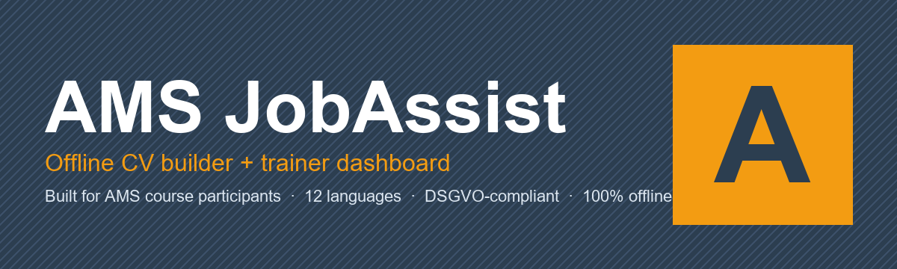
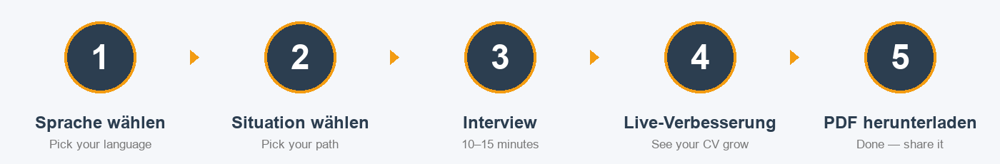
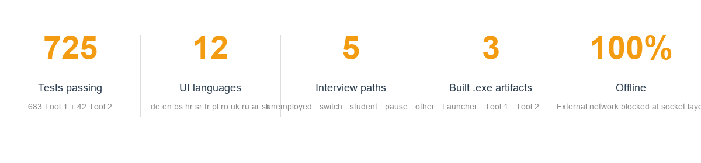
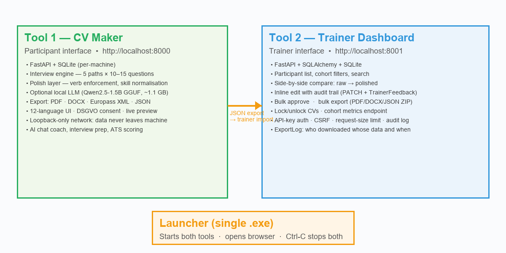

<p align="center">
  
</p>

# AMS JobAssist

**An offline CV builder for AMS course participants — with a trainer dashboard for supervision.**
Built for AMS Wien classroom use — currently a polished demonstrator awaiting pilot validation. Runs entirely on the trainer's laptop. No cloud, no data leaves the device.


---

## What it does in one sentence

A participant who has never written a CV in their life sits down for 15 minutes, answers questions in their native language, and walks away with a polished German PDF/DOCX/Europass CV that a trainer has supervised in real time.

<p align="center">
  
</p>

---

## Quick start

### Double-click `START.bat`

That's it. The script auto-detects the best way to run:

- **Pre-built `.exe` files in `dist/`?** → Runs them directly. No Python needed.
- **Python installed?** → Installs dependencies and runs from source.
- **Neither?** → Tells you exactly what to download.

The browser opens automatically to the CV maker on `http://localhost:8000`. The trainer dashboard is on `http://localhost:8001`.

### For developers

```bash
git clone https://github.com/PapaKoftes/AMS-JobAssist
cd AMS-JobAssist
pip install -r requirements.txt
python launcher.py
```

### Build standalone `.exe` files

```bat
build_all.bat
```

Produces standalone executables in `dist/` (no Python needed on target machine):

| File | Size | What it does |
|---|---|---|
| `AMS-JobAssist-Launcher.exe` | 8 MB | Starts both tools, opens browser |
| `AMS-JobAssist-Tool1.exe` | 375 MB | Participant CV maker (includes optional LLM runtime) |
| `AMS-JobAssist-Tool2.exe` | 46 MB | Trainer dashboard |
| `install.bat` | 8 KB | Batch installer — Start Menu + Add/Remove Programs |

### Install / uninstall options

| Method | How | What you get |
|---|---|---|
| **`START.bat`** | Double-click at repo root | Auto-detects best method, handles everything |
| **Run directly** | Double-click `dist\AMS-JobAssist-Launcher.exe` | Works instantly, no install step |
| **Batch installer** | Run `dist\install.bat` | Start Menu + Desktop shortcut + Add/Remove Programs |
| **Inno Setup** | Install [Inno Setup](https://jrsoftware.org/isinfo.php), run `build_all.bat` | Full `Setup.exe` with wizard, German UI, clean uninstall |

All install methods are per-user (no admin rights needed). Uninstall preserves user data by default.

---

## The numbers

<p align="center">
  
</p>

---

## Architecture

<p align="center">
  
</p>

Two FastAPI servers, each with its own SQLite database, talking to a vanilla-JS frontend. Tool 1 is the participant interface; Tool 2 is the trainer interface. They are intentionally decoupled — the trainer dashboard imports participant data via a JSON file the trainer drops in, so the two databases never share storage and Tool 1 can run with zero network exposure.

```
AMS-JobAssist/
├── tool-1-cv-maker/          Participant interface
│   ├── src/backend/          FastAPI + SQLite + interview/polish/export engines
│   ├── src/frontend/         Vanilla JS, 12-language UI, live preview
│   └── tests/                697 tests
├── tool-2-trainer-dashboard/ Trainer interface
│   ├── src/backend/          FastAPI + SQLAlchemy + audit middleware
│   ├── frontend/             Vanilla JS table view + side-by-side compare
│   └── tests/                45 tests
├── shared/schema/            Canonical CV Pydantic schema (Tool 1 ↔ Tool 2)
├── packaging/                3 PyInstaller specs + icon.ico
├── docs/                     Trainer guide · admin guide · screenshots
├── build_all.bat             Reproducible Windows build
├── launcher.py               Single-process starter
└── ams_jobassist.bat         End-user German menu (install/start/uninstall)
```

---

## Feature matrix

### For participants

| Feature | Status | Notes |
|---|---|---|
| 5 interview paths | ✅ | Unemployed · career switch · student · pause · other |
| Multi-language input | ✅ | 12 UI languages; polish pipeline detects 14+ input languages |
| Live preview | ✅ | See your CV growing as you answer |
| Quality scoring | ✅ | Encouraging feedback ("a little more detail helps") |
| Quick-fill chips | ✅ | One-tap starters for common answers |
| Date helper | ✅ | "approximate" allowed — no shame on forgotten dates |
| Photo upload | ✅ | Optional — Austrian-style CV with photo |
| Resume after close | ✅ | Browser session restores from where you left off |
| PDF / DOCX / Europass / JSON export | ✅ | All four formats, deterministic output |
| Cover letter generator | ✅ | AI-assisted, downloadable as TXT |
| ATS / job match | ✅ | Paste a job listing, see matched + missing keywords |
| AI chat coach | ✅ (optional) | Knows your CV; falls back to rule-based if no model |
| Interview prep generator | ✅ (optional) | Practise questions for the actual job interview |
| DSGVO data download | ✅ | Article 20 — download everything stored about you |
| Loopback-only network | ✅ | Default-on; data physically cannot leave the machine |

### For trainers

| Feature | Status | Notes |
|---|---|---|
| Participant list | ✅ | Cohort filter, status filter, name search, pagination |
| Side-by-side compare | ✅ | What the participant wrote vs. what the CV says |
| Inline edit | ✅ | Click → edit → save instantly. Audit trail per change. |
| Bulk approve | ✅ | "Approve all ready CVs" with one click |
| Bulk export | ✅ | PDF / DOCX / JSON zipped for all selected participants |
| Lock / unlock CV | ✅ | Trainer can freeze a CV against further participant edits |
| Cohort metrics | ✅ | Completion rate, average quality, last-active timestamps |
| Per-export audit log | ✅ | `ExportLog` table records who downloaded whose CV, when |
| API-key auth | ✅ | `AMS_TRAINER_API_KEY` env var enables it |
| Request-size limit + CSRF | ✅ | Hardened middleware stack |
| Notes per participant | ✅ | Standalone save button, never shown to participant |
| Cohort creation UI | 🚧 | Backend done; frontend UI pending |

### Accessibility

| Feature | Status |
|---|---|
| Skip-navigation link | ✅ |
| Visible `:focus-visible` indicators | ✅ |
| 44×44 px touch targets | ✅ |
| RTL layout for Arabic | ✅ |
| `prefers-reduced-motion` honoured | ✅ |
| `prefers-contrast: more` honoured | ✅ |
| Font-size scaler | ✅ |
| `aria-live` for save status, quality, preview | ✅ |
| Print stylesheet | ✅ |
| Full screen-reader audit | 🚧 |
| WCAG AA automated scan (axe / Lighthouse) | 🚧 |

---

## Privacy & DSGVO

This is not a marketing claim — it is enforced at the socket layer.

- **Default-on offline mode.** `tool-1/privacy/network_block.py` monkey-patches `socket.socket`, `socket.getaddrinfo`, `urllib.request.urlopen`, and `http.client.{HTTP,HTTPS}Connection` to refuse any non-loopback destination. Strict loopback-only (127.0.0.1, ::1, localhost) — no cloud allowlist, no exceptions. Disable only with `AMS_ENFORCE_OFFLINE=0` for development.
- **Per-machine SQLite.** Each laptop has its own `ams_jobassist.db`. No central server, no cloud sync.
- **Consent screen.** The "Create my CV" button is disabled until the participant ticks the box acknowledging local-only storage.
- **DSGVO Art. 20 portability.** Endpoint `GET /api/cv/{session_id}/my-data` returns every byte stored about the participant as a JSON download. Wired to the 🔒 *Meine Daten herunterladen* button.
- **DSGVO Art. 17 right to be forgotten.** `privacy/data_deletion.py` cascades from `users` → sessions → answers → cv_data → exported files, then verifies deletion.
- **Configurable retention.** Set `AMS_DATA_RETENTION_DAYS=90` and incomplete sessions older than that are deleted daily. Approved CVs are kept.
- **Trainer audit trail.** Every state-changing call in Tool 2 is logged with timestamp + API-key identity. Every export writes an `ExportLog` row.

---

## Running tests

```bash
# Tool 1 — 697 tests
cd tool-1-cv-maker
python -m pytest tests/ --ignore=tests/demo_test.py -q

# Tool 2 — 45 tests
cd ../tool-2-trainer-dashboard
python -m pytest tests/ -q
```

---

## Documentation map

| Document | Audience | Purpose |
|---|---|---|
| [FOR_MARKO.md](FOR_MARKO.md) | External reviewer | 5-min install + what to try + feedback questions |
| [DEMO_GUIDE.md](DEMO_GUIDE.md) | You, running the demo | Step-by-step script for showing the tool |
| [PITCH.md](PITCH.md) | AMS leadership | One-page case for adoption |
| [docs/AMS_INSTRUCTOR_GUIDE.md](docs/AMS_INSTRUCTOR_GUIDE.md) | AMS trainers | What it does for them, plain-language |
| [docs/ADMINISTRATOR_GUIDE.md](docs/ADMINISTRATOR_GUIDE.md) | AMS IT | Install, configure, data paths |
| [docs/TRAINER_DECISIONS_CHECKLIST.md](docs/TRAINER_DECISIONS_CHECKLIST.md) | AMS subject experts | Pre-launch sign-off items |
| [docs/FAQ.md](docs/FAQ.md) | Everyone | Common questions |
| [ARCHITECTURE.md](ARCHITECTURE.md) | Developers | Module map, data flow, deployment |
| [API_DOCUMENTATION.md](API_DOCUMENTATION.md) | Developers / IT | REST contract |
| [PRIVACY_ENFORCEMENT.md](PRIVACY_ENFORCEMENT.md) | DSGVO auditors | How offline is enforced |
| [PLAN.md](PLAN.md) | Maintainers | Living checklist of everything done / pending |
| [PROGRESS.md](PROGRESS.md) | Maintainers | Phase milestones |
| [docs/screenshots/README.md](docs/screenshots/README.md) | Anyone running the demo | Screenshot capture checklist |

---

## Known limitations

Honest about what this is and isn't:

- **Desktop only.** Windows 10/11 is the target platform. The UI is touch-friendly (44 px targets, RTL Arabic) but designed for keyboard + mouse. Tablet form factor is not optimised yet.
- **No multi-trainer real-time collaboration.** Tool 2 is single-trainer-at-a-time on one machine. There is no central server, no shared state across laptops.
- **No central admin server.** Each laptop is independent. Backups are per-machine (one-click via `GET /api/admin/backup`).
- **Interview examples are placeholders.** The good/bad example chips next to each question contain Mina-authored sample text. Real AMS sign-off and anonymised real-cohort samples are needed before classroom pilot.
- **12 UI translations have not been native-speaker reviewed.** German and English are author-quality. The other 10 are LLM-assisted and unverified by native speakers.
- **Rules-first AI architecture.** The rule engine (117 German verbs, 70 English verbs, 428 multilingual skills) does the heavy lifting — verb enforcement, skill normalization, ATS optimization. A local knowledge base (25 Austrian jobs from AMS Berufslexikon with 197 verbs, 171 skills, 75 example phrases) provides domain context. The local LLM (3 tiers: light/medium/full) only enhances already-polished text for natural flow. Falls back to Ollama, then rule output as-is.
- **Authenticode code-signing is not yet applied** to the `.exe` artifacts. Windows SmartScreen will warn on first run. A signing certificate is on the to-do list.
- **Full WCAG 2.1 AA automated audit (axe-core / Lighthouse) has not been run.** The CSS scaffolding (focus rings, touch targets, prefers-reduced-motion / prefers-contrast / RTL / print stylesheet, skip-link) is in place but not externally verified. Screen-reader testing with NVDA / JAWS is pending.
- **Cohort creation UI and per-participant trainer-notes UI are pending** in Tool 2. The backend supports both (cohort filters, `trainer_notes` column); the frontend table view doesn't yet expose them.
- **Conversational LLM interview is not implemented.** It was a 501-skeleton placeholder; that placeholder has been removed and will return when the feature is actually built.
- **The maintainer is one person** (MIT license, no organisation backing). For a real AMS deployment, expect either a service contract with the maintainer or an AMS-internal fork.

---

## Status

- **Tool 1 (CV Maker):** ✅ Production-ready
- **Tool 2 (Trainer Dashboard):** ✅ All spec features wired with audit/auth
- **Windows .exe build:** ✅ Reproducible — 3 artifacts produced from `build_all.bat`
- **Tests:** ✅ 742 passing (697 T1 + 45 T2)
- **Accessibility quick wins:** ✅ Focus rings, touch targets, RTL Arabic, print stylesheet, contrast/motion preferences
- **AMS trainer sign-off:** ⏳ Pending — see [TRAINER_DECISIONS_CHECKLIST.md](docs/TRAINER_DECISIONS_CHECKLIST.md)
- **Pilot in a real classroom:** ⏳ Pending an AMS partner

License: MIT — open for AMS centres and any other employment service to use and modify.
