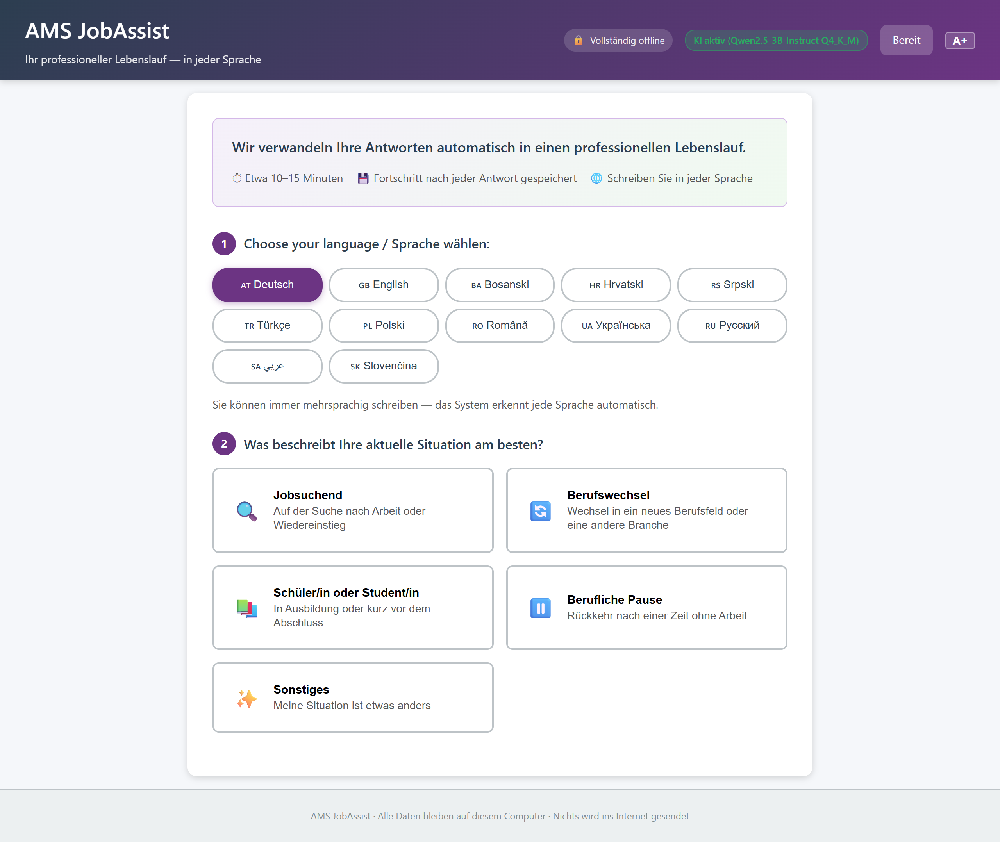
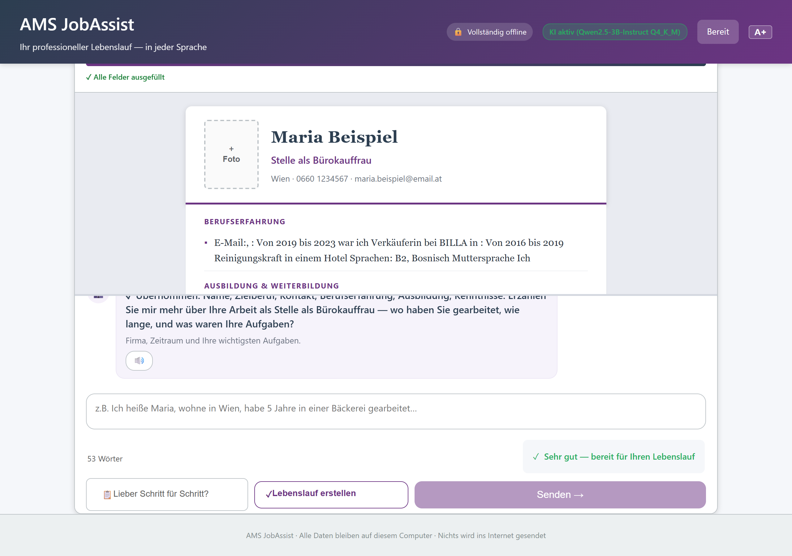
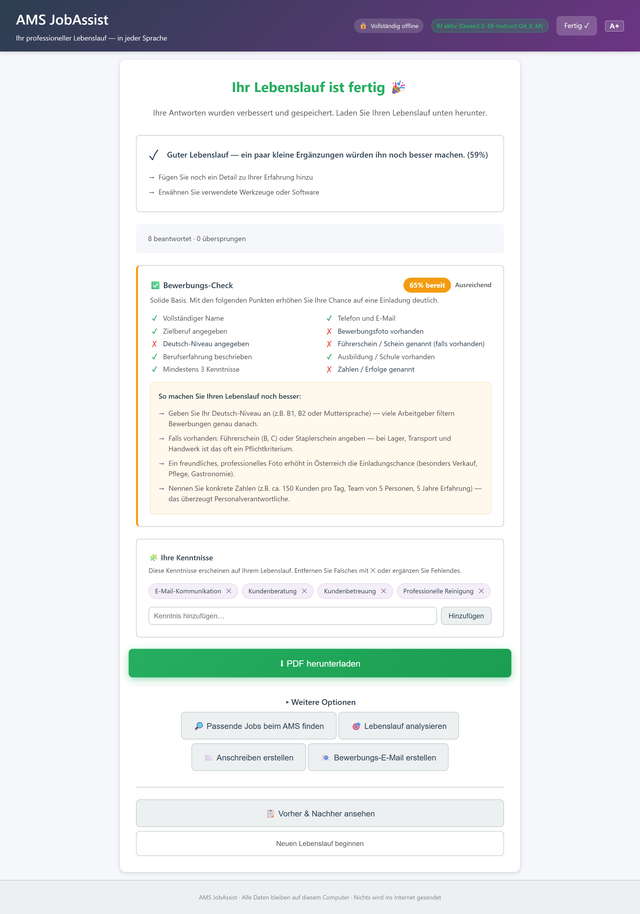

# AMS JobAssist — Instructor Guide

**For AMS trainers and course leaders. No technical background required.**

---

## 1. What it is

AMS JobAssist is a small program that runs on your own laptop and helps your course participants build a professional CV through a friendly, guided interview. It does not require accounts, it does not send data anywhere, and it works entirely offline once started. You, the trainer, get a separate dashboard to supervise, edit, approve and export every CV in your cohort.

> **Kurzfassung:** Ein Werkzeug, das schüchternen Teilnehmer:innen das Gefühl gibt: *"Ich habe doch etwas geleistet."* Und das Ihnen als Trainer:in die mühsame Korrekturarbeit abnimmt — ohne dass Sie die Kontrolle abgeben.

---

## 2. The promise to you as a trainer

1. **Your participants will finish their CV.** The interview is broken into one question per screen with examples, skip buttons, and autosave. Nobody is left staring at a blank page.
2. **You will review a full cohort in under an hour.** Side-by-side raw-vs-polished view, inline edits, bulk approve, bulk export — built for classroom speed, not for IT departments.
3. **Nothing leaves the laptop.** The program physically refuses outbound network connections. DSGVO compliance is enforced at the network layer, not promised on a slide.
4. **It works in 12 UI languages.** German, English, Turkish, Arabic (right-to-left), Bosnian, Croatian, Serbian, Polish, Romanian, Russian, Ukrainian, Slovak. Participants pick their language on screen 1. (Input is auto-detected — write in any of those 12, and the output is polished German.)
5. **The CV looks professional.** Three export formats: PDF (print-ready), DOCX (you can fine-tune in Word), Europass XML (works with EU job portals).
6. **You teach with it, not just generate.** The before/after view is designed to be projected in class: *"See how we turned 'I did stuff' into a real CV line."*
7. **It runs from a single .exe.** No installation, no admin rights, no Python, no Docker. Click, the browser opens, you work.

---

## 3. The participant experience

The participant goes through five gentle steps. Each step has been designed against the 16 most common reasons course participants quit a CV exercise (input fear, language insecurity, the *"I did nothing special"* mindset, date confusion, shame).

### Step 1 — Welcome and consent

The participant picks their language, sees a one-screen explanation of what the tool does and what data is stored, and gives explicit DSGVO consent. No consent, no data — they can stop here without leaving a trace.

### Step 2 — Choose a path

| Path | Who it is for |
|---|---|
| Arbeitssuchend | Currently unemployed, has prior work history |
| Berufswechsel | Changing career direction |
| Schüler:in / Studierende:r | First CV, no significant work history yet |
| Wiedereinstieg | Returning after a pause (parental leave, illness, caregiving) |
| Sonstiges | Anything else — open-ended path |

Each path asks 10–15 questions tailored to that situation. A career-switcher gets different prompts than a school-leaver. Nobody is asked about "managerial achievements" if they are 17.

### Step 3 — The guided interview

One question per screen. Every question shows:

- A **good example** (concrete, with verbs and tools)
- A **less helpful example** (vague, abstract)
- A **textarea** that accepts any language
- A **Skip for now** button (returns to it later)
- A **Saved ✓** indicator (autosave on every keystroke pause)

On the right, a **live preview** of the CV builds up as they type. They watch *"I worked in a Lager"* become *"Lagermitarbeiter — Kommissionierung, Bestandsführung mit SAP, Wareneingangskontrolle."* That moment is the whole point of the tool.

> **Trainer tip:** Project this screen at the front of the room on Day 1 and walk through one question together. Once participants have seen the rhythm — question, example, type, watch it improve — they relax and work on their own.

### Step 4 — Quality feedback and re-ask

If an answer is too short or too vague, the participant gets a gentle nudge:

- ✓ **Good** — concrete, has verbs, mentions tools or impact
- ⚠ **Needs detail** — suggests *"add what tools you used"* or *"add how many people you worked with"*
- ✗ **Too vague** — re-asks the question with a different prompt

Tone is always *"Can you tell us a bit more?"* — never *"insufficient"* or *"weak."*

### Step 5 — Completion and downloads

The participant sees their finished CV and can:

- Download as **PDF** (ready to print or email)
- Download as **DOCX** (open in Word, edit further)
- Download as **Europass XML** (upload to EURES, AMS eJob-Room)
- See an **ATS keyword score** against a job description they pasted
- Generate a matching **cover letter** in the same language
- Optionally chat with the **AI coach** for tips (uses a small local AI model, falls back to rule-based suggestions if the model is not loaded)

Everything stays on the laptop. The participant can also download a copy of *all their own data* (DSGVO Article 20) as a single JSON file, or delete everything (Article 17).

---

## 4. Your dashboard

The trainer dashboard is a separate window. It is protected by an API key that you set once (the technician who installs it will configure `AMS_TRAINER_API_KEY` for you — participants cannot reach it).

### The participant list

You see every participant in your cohort with:

| Column | What it tells you |
|---|---|
| Name | Participant's chosen display name |
| Status | Draft / In review / Approved / Locked |
| Progress | 0–100% — how far through the interview |
| Last activity | When they last saved |
| Cohort | Which course group they belong to |

You can **filter** by cohort, status, or name, and you can **search** by free text. A red dot marks CVs that need your attention.

### Side-by-side review and inline edit

Click a participant and you see two columns:

- **Left:** exactly what they wrote, in their own words
- **Right:** the polished version that will go on the CV

Click any line on the right to edit it directly. No modals, no popups, no save buttons — type and move on. Every edit is logged (who, when, what changed) so you have an audit trail.

When you are happy, click **Approve**. The CV is now locked and ready for export.

> **Trainer tip:** The left column is gold for teaching. Take a participant aside, point at it, and say *"Look — this is what we started with. Now look right. Can you see what changed?"* This is the AMS pedagogical moment.

### Bulk operations

- **Bulk approve** — tick 20 CVs, click approve once.
- **Bulk export** — choose PDF, DOCX or JSON, get a single `.zip` with all CVs inside, ready for your records.
- **Lock / unlock** — freeze a CV so the participant cannot accidentally overwrite your edits.
- **Cohort metrics** — completion rates, average CV quality score, time spent per participant.

---

## 5. What stays on your laptop

| Question | Answer |
|---|---|
| Does any participant data go to the internet? | No. The program binds only to `127.0.0.1` and refuses outbound connections at the network layer. |
| Does the AI coach call ChatGPT or any cloud? | No. The primary engine is a rule-based system with an Austrian job knowledge base (25 Berufe). A local AI model (3 sizes for different hardware) optionally enhances the output. Everything runs on the laptop. |
| Where are the CVs stored? | In a single SQLite file on your laptop, in the `data/` folder next to the program. |
| How long are they kept? | Configurable via `AMS_DATA_RETENTION_DAYS`. Default is 90 days, then auto-deleted. |
| Can a participant download their own data? | Yes — DSGVO Article 20 endpoint built in. |
| Can a participant request deletion? | Yes — DSGVO Article 17. One click, gone. |
| Is there an audit log? | Yes — every export and every trainer edit is recorded in the `ExportLog` and `TrainerFeedback` tables. |

> **Datenschutz-Versprechen:** Wenn Sie das Programm beenden und den `data/`-Ordner löschen, ist nichts mehr da. So einfach.

---

## 6. Typical course usage

### Day 1 — Introduction (45 minutes)

1. Open the tool on your laptop, project it.
2. Pick *"Arbeitssuchend"* together as a class.
3. Answer the first two questions out loud with the group — they see the live preview build up.
4. Hand out one laptop per participant (or send them home with the link to localhost on their own machine if the IT setup allows).
5. They give consent, pick their language, choose their path, start.

### Day 2 — Interview day (in class or homework)

Participants do the interview at their own pace. Most finish in 30–60 minutes. Autosave means they can leave and come back. You walk around and answer questions like *"Soll ich auch Praktika erwähnen?"* — yes, always.

### Day 3 — Trainer review (5 minutes per participant)

You open the dashboard, work through the list in order. For each participant:

1. Click the row.
2. Scroll the side-by-side view.
3. Fix the 1–2 things that look off (inline edit).
4. Click **Approve**.
5. Next.

Twenty participants take you about 60–90 minutes. Bulk export, download the .zip, print or email.

### Day 3 afternoon — Group reflection

Pick three CVs (with permission) and project the before/after view. This is where the AMS pedagogy lives: *"Why is the right column stronger? What did we add? What did we remove?"* Participants learn CV writing by watching their own work be elevated.

---

## 7. Before your pilot

Before you run the tool with a real cohort, please go through **[TRAINER_DECISIONS_CHECKLIST.md](TRAINER_DECISIONS_CHECKLIST.md)**. It covers the small set of decisions only you can make:

- Which of the 5 paths are right for your cohort? Any to add?
- Are the example answers realistic for your participants' jobs?
- Which languages will you actually need active?
- Any AMS-specific wording rules to enforce?
- How will you integrate the before/after view into your lesson plan?
- Retention period: 30, 60, 90 days?

Most trainers finish the checklist in 30 minutes with a coffee.

---

## 8. FAQ

**Q: What if a participant writes in broken German or mixes languages?**
A: That is normal and expected. The tool accepts any language they type, silently normalises the output to German (or the target language they picked), and never exposes the raw input to other participants. Their dignity is protected.

**Q: What if someone does not remember exact dates?**
A: They can write *"ungefähr 2018"* or *"weiß ich nicht mehr"*. The CV will mark it as approximate, and you can fix it in your review.

**Q: What if the AI gets something factually wrong?**
A: You always see what the participant wrote on the left. If the right column invented something, you fix it in one click. The participant never sees a polished version you have not approved if you use the *Locked* workflow.

**Q: What if a participant has very little to put in their CV?**
A: This is exactly who the tool is built for. The skill-normalisation layer turns *"Bürotätigkeiten"* into *"Microsoft Office (Word, Excel, Outlook), Terminorganisation, Ablage"*. The interview asks about daily tasks, tools, and people they helped — not "achievements." Nobody is exposed for not having a corporate career.

**Q: Can I run this without internet?**
A: Yes — that is the default. Internet is not needed at any point. The program physically blocks outbound traffic. Useful for AMS rooms with restricted networks.

---

## Architecture (for the curious)

Three small programs, each a single `.exe` built from `build_all.bat`:

- **Tool 1** — the participant CV maker
- **Tool 2** — your trainer dashboard
- **Launcher** — opens both with one click

922 automated tests run before every release (852 for Tool 1, 57 for Tool 2, 13 packaging). Accessibility built in: skip links, focus rings, 44-pixel touch targets, Arabic right-to-left support, `prefers-reduced-motion`, `prefers-contrast`, print stylesheet.

---

**You are ready to use this in your next class.**

See **[../DEMO_GUIDE.md](../DEMO_GUIDE.md)** for a five-minute walkthrough you can follow on your own laptop before Day 1.
